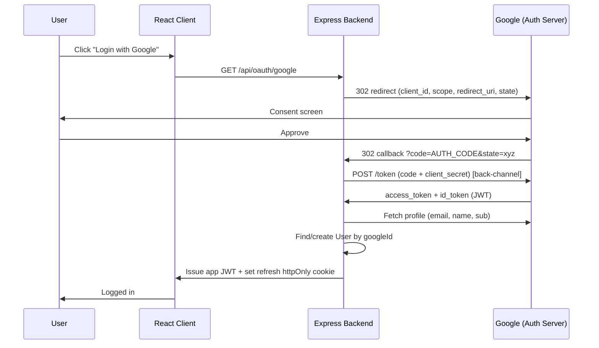
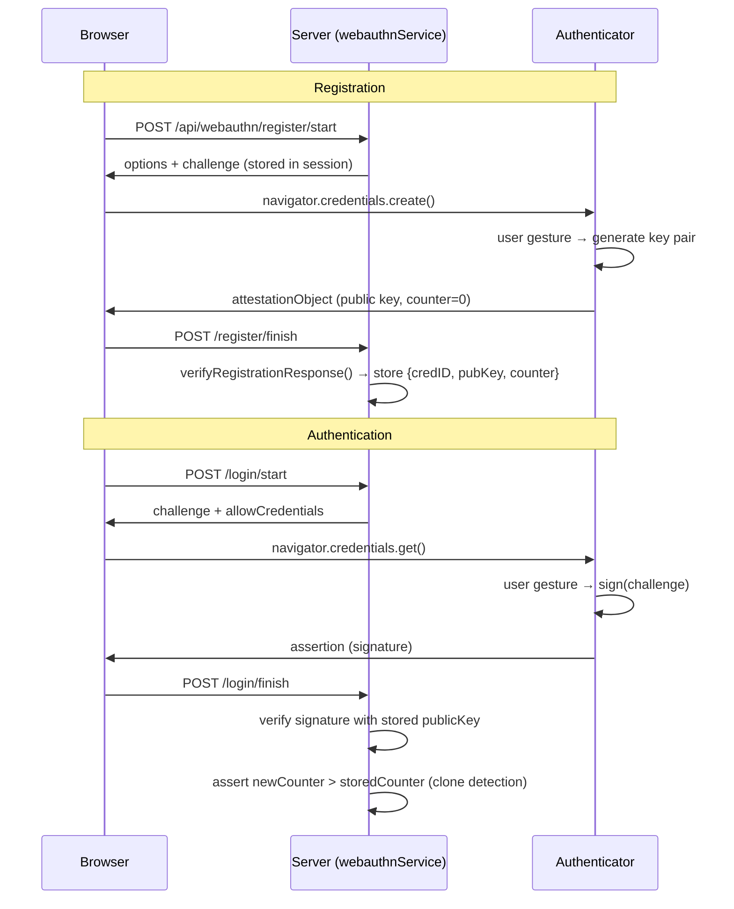
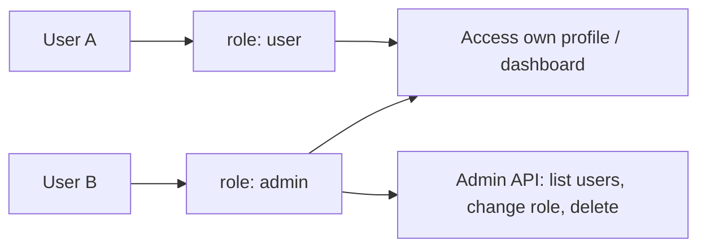
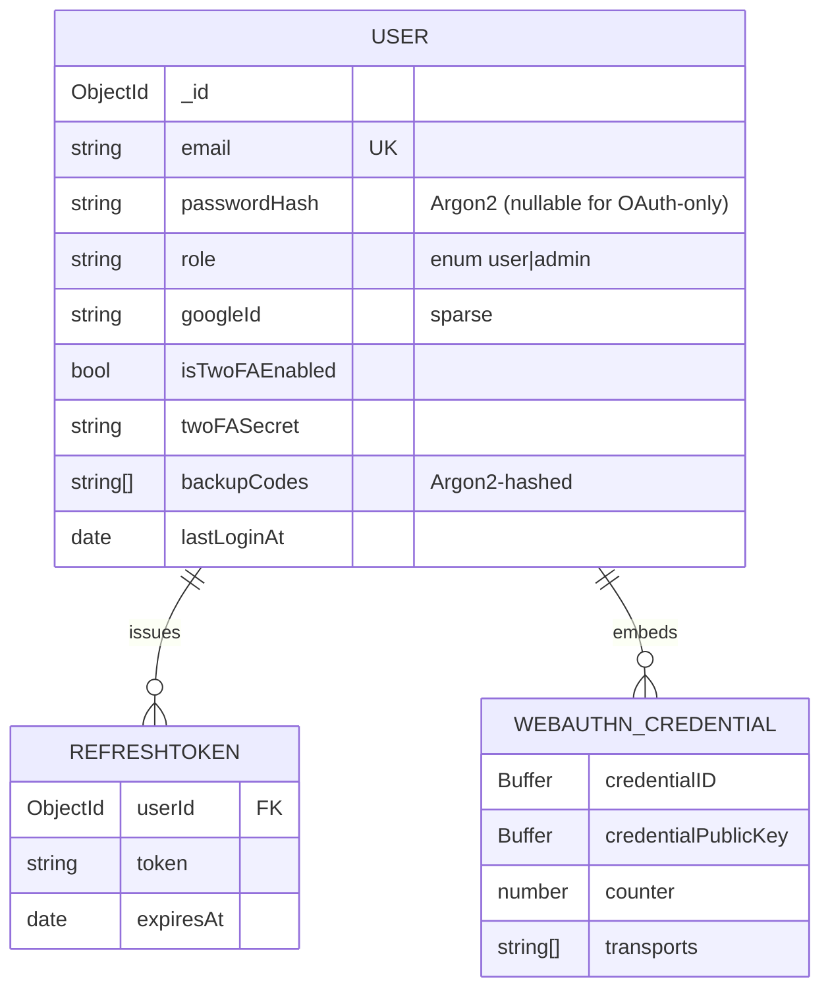

# Research & System Architecture — Advanced Identity & Access Management

> Midterm Topic #1 · Course: WEB PROGRAMMING & APPLICATIONS — 503073
> Stack: React + Vite (frontend) · Node.js + Express (backend) · MongoDB Atlas
> Scope: OAuth 2.0 / OIDC · JWT · Argon2 password hashing · TOTP 2FA · WebAuthn · RBAC
>
> *Language note: written in English to feed the report's Theoretical Survey and System Design sections directly (the rubric deducts 1.0 point for non-English reports).*

---

## Abstract

This document establishes the theoretical foundation and system architecture for an Advanced Identity & Access Management (IAM) demonstration platform built on a React + Express + MongoDB stack. It surveys six interlocking authentication and authorization mechanisms — OAuth 2.0 / OpenID Connect, JSON Web Tokens, Argon2 password hashing, TOTP two-factor authentication, WebAuthn/FIDO2, and Role-Based Access Control — and for each presents the underlying concept, a worked example, security strengths and weaknesses, and a comparative analysis against realistic alternatives. A consistent four-capability threat model (network sniffing, phishing, database-dump theft, request replay) is used to evaluate every mechanism. The architecture is defined *before* implementation, in accordance with the course rubric, and is presented through UML/Mermaid component, activity, and entity-relationship diagrams. The central thesis is that no single mechanism is sufficient: the platform deliberately *layers* them so that the weakest property of any one factor (e.g., TOTP's lack of phishing resistance) is compensated by another (WebAuthn's origin-bound credentials).

## Keywords

Identity & Access Management; OAuth 2.0; OpenID Connect; JSON Web Token; Argon2id; TOTP; WebAuthn; FIDO2; Role-Based Access Control; threat modeling; refresh-token rotation.

---

## Table of Contents

1. [Introduction & Problem Statement](#1-introduction--problem-statement)
2. [Theoretical Survey](#2-theoretical-survey)
   - 2.1 [OAuth 2.0 & OpenID Connect](#21-oauth-20--openid-connect)
   - 2.2 [JSON Web Tokens (JWT)](#22-json-web-tokens-jwt)
   - 2.3 [Password Hashing — Argon2 vs bcrypt](#23-password-hashing--argon2-vs-bcrypt)
   - 2.4 [Two-Factor Authentication — TOTP](#24-two-factor-authentication--totp)
   - 2.5 [WebAuthn / FIDO2](#25-webauthn--fido2)
   - 2.6 [Role-Based Access Control (RBAC)](#26-role-based-access-control-rbac)
3. [System Architecture](#3-system-architecture)
4. [Comparative Analysis](#4-comparative-analysis)
5. [Strengths & Weaknesses Summary](#5-strengths--weaknesses-summary)
6. [Conclusion & Future Work](#6-conclusion--future-work)
7. [References (IEEE)](#7-references-ieee)

---

## 1. Introduction & Problem Statement

Modern web applications can no longer treat authentication as a single password check. A production-grade Identity & Access Management (IAM) system must answer three distinct questions:

| Question | Concern | Mechanism in this project |
|----------|---------|---------------------------|
| *Who are you?* | **Authentication** | Password+Argon2, Google OIDC, WebAuthn |
| *Can you prove it twice?* | **Multi-factor** | TOTP 2FA, WebAuthn as a possession factor |
| *What are you allowed to do?* | **Authorization** | JWT claims + RBAC middleware |

This research defines the theory and architecture **before** implementation, as required by the rubric ("Clearly define the System Architecture before writing code"). It surveys six authentication/authorization pillars, contrasts each with its realistic alternatives, and presents the layered architecture the demonstration website implements.

The threat model assumed throughout: an attacker who can (a) sniff network traffic, (b) phish the user, (c) steal a leaked database dump, and (d) replay captured requests. Each mechanism below is evaluated against these four capabilities.

---

## 2. Theoretical Survey

### 2.1 OAuth 2.0 & OpenID Connect

#### Concept

OAuth 2.0 (RFC 6749 [1]) is an **authorization-delegation** framework: it lets a Client act on a Resource Owner's behalf without ever seeing their password. Four roles participate:

| Role | Concrete example here |
|------|----------------------|
| Resource Owner | The end user |
| Client | Our React + Express application |
| Authorization Server | `accounts.google.com` |
| Resource Server | Google's userinfo / `photos.googleapis.com` |

The Authorization Server and Resource Server are conceptually separate even when both are operated by Google.

The access token itself comes in two forms, a distinction that drives the resource-server verification cost:

| Token form | Verification | Cost |
|------------|--------------|------|
| **Opaque** | Resource Server must call the Authorization Server's introspection endpoint | Network round-trip per request |
| **JWT** | Resource Server self-verifies the signature with a known key | Local CPU only — chosen here (§2.2) |

This project issues **JWT** access tokens so the Express resource layer verifies them locally with no round-trip to an external introspection endpoint.

#### Grant types and why we chose Authorization Code

| Flow | Use case | client_secret? |
|------|----------|----------------|
| **Authorization Code** | Web app *with* backend — most secure | Yes |
| Authorization Code + PKCE | SPA / mobile (no confidential secret) | No (RFC 7636 [9]) |
| Client Credentials | Server-to-server, no user | Yes |
| Implicit | **Deprecated** — token leaks via URL/history | No |

This project uses the **Authorization Code flow** via `passport-google-oauth20`, because the Express backend is a confidential client that can safely hold `GOOGLE_CLIENT_SECRET`. The Implicit flow is deprecated precisely because returning a token directly in the redirect URL exposes it in browser history, server logs, and `Referer` headers.

For clients that *cannot* keep a secret (SPA/mobile), **PKCE** (RFC 7636 [9]) hardens the same code flow without a `client_secret`: the client generates a random `code_verifier`, sends `code_challenge = SHA256(code_verifier)` when requesting the code, then presents the raw `code_verifier` at token exchange; the Authorization Server grants the token only if `SHA256(code_verifier)` matches the earlier `code_challenge`. This binds the redeemed code to the originating client, defeating authorization-code interception. Our confidential backend does not require PKCE, but it is the correct choice for the public-client variant noted above. When a long-lived refresh token is needed, the authorization request additionally sets `access_type=offline` so Google returns a refresh token alongside the access token.

#### Authorization Code flow sequence



Two security details are essential and implemented in `server/config/passport.js` / `server/routes/oauth.js`:

- **`state` parameter** — a random value bound to the session; mismatched on callback ⇒ reject. Defends against CSRF on the redirect.
- **Back-channel code exchange** — the one-time `code` (≈10 min TTL) travels through the URL, but the token exchange happens server-to-server over POST, so the token itself never appears in the browser.

#### OAuth 2.0 vs OpenID Connect

"Login with Google" is technically **OIDC**, not raw OAuth 2.0. OIDC layers an **ID Token** (a JWT describing *who the user is*) on top of OAuth's access token (*what the client may do*). The mandatory `openid` scope triggers issuance of the ID Token, whose decoded payload supplies `sub`, `email`, and `name`. Passport handles this transparently.

| | OAuth 2.0 | OpenID Connect |
|--|-----------|----------------|
| Purpose | Authorization | Authentication |
| Built on | — | OAuth 2.0 |
| Extra token | Access Token | + ID Token (JWT) |
| Mandatory scope | optional | `openid` |

#### Strengths / Weaknesses

**Strengths:** the user's Google password is never exposed to our app; revocation is centralized at Google; least-privilege scopes (`openid email profile`) limit data exposure.
**Weaknesses:** hard dependency on a third-party IdP (Google outage = no social login); redirect-URI misconfiguration is a common, time-costly bug (mitigated by Google Cloud "Testing" mode with explicit test users); account-linking ambiguity when an OAuth email collides with an existing password account.

---

### 2.2 JSON Web Tokens (JWT)

#### Structure

A JWT (RFC 7519 [4]) is three base64url segments joined by dots: `HEADER.PAYLOAD.SIGNATURE`. The payload is **encoded, not encrypted** — never place secrets in it.

```json
// Payload (claims)
{ "userId": "664123", "role": "admin",
  "iat": 1715000000, "exp": 1715003600 }
```

| Algorithm | Type | When |
|-----------|------|------|
| `HS256` | Symmetric (one shared secret) | Internal single-service — used here |
| `RS256` | Asymmetric (private signs, public verifies) | Public APIs, many verifiers |

This project uses **HS256** because a single Express service both issues and verifies tokens — asymmetric keys would add operational overhead with no benefit at this scope.

#### Access + Refresh token strategy (Decision #5)

| | Access Token | Refresh Token |
|--|-------------|---------------|
| Lifetime | Short (15 min) | Long (7 days) |
| Storage | **In memory** (JS variable, not localStorage) | **httpOnly cookie** (`secure`, `sameSite=strict`) |
| Sent to | Every API request (`Authorization: Bearer`) | Only `/api/auth/refresh` |
| If leaked | Damage capped at ~15 min | Dangerous — must revoke immediately |

Storing the access token in memory (not `localStorage`) removes it from the XSS attack surface; the refresh token in an `httpOnly` cookie is unreadable by JavaScript and `sameSite=strict` blocks CSRF. The trade-off: a full page reload loses the in-memory access token, so the axios interceptor silently calls `/refresh` on the first 401.

#### Revocation problem

A stateless JWT cannot be invalidated before `exp`. Mitigations:

| Strategy | Trade-off |
|----------|-----------|
| Short-lived access token (15 min) — **chosen default** | Bounded time-window of damage |
| Refresh-token **rotation** + DB store (`RefreshToken` model) | Each refresh issues a new token and revokes the old; reuse of a revoked token ⇒ detect theft |
| Redis `jti` blocklist | Adds infrastructure + per-request lookup |
| Rotate `JWT_SECRET` | Emergency only — logs everyone out |

This project implements **refresh-token rotation** (the `RefreshToken` collection persists issued tokens), which is the Auth0-recommended pattern [5].

> **Security incident recorded during D9:** the `authenticate` middleware initially accepted *any* signed JWT, including the short-lived `tempToken` issued mid-2FA. A 2FA-pending token must be rejected by `authenticate` — only the final post-2FA token grants API access. Fixed 2026-05-15.

**JWT vs Session:** sessions store state server-side (easy revoke, hard horizontal scale); JWT is stateless (easy scale, hard revoke). JWT suits an API + OAuth architecture; sessions suit a monolith. This project deliberately combines both: stateless access JWT for API calls, a server-side `RefreshToken` record so refresh tokens *can* be revoked.

---

### 2.3 Password Hashing — Argon2 vs bcrypt

#### Why not just hash?

Fast hashes (MD5, SHA-256) are catastrophic for passwords: a GPU computes billions/sec. A password hash must be **deliberately slow** and **memory-hard** so offline brute-force after a DB breach is economically infeasible.

#### Argon2 (RFC 9106 [6])

Argon2id (the recommended hybrid variant) is the Password Hashing Competition winner. It is tunable on three axes:

| Parameter | Meaning | Effect |
|-----------|---------|--------|
| `memoryCost` | RAM per hash (e.g. 64 MB) | **Memory-hard** — defeats cheap GPU/ASIC parallelism |
| `timeCost` | Iterations | Raises CPU cost linearly |
| `parallelism` | Threads | Tunes to server cores |

The stored string is self-describing: `$argon2id$v=19$m=65536,t=3,p=4$<salt>$<hash>` — salt and parameters travel with the hash, so verification needs no separate columns.

This project uses the `argon2` npm package (Decision #6), with **bcryptjs as a documented fallback** because `argon2` is a native module that can fail to build on Windows without Visual Studio Build Tools (Risk R1 — tested on all three team machines on D1).

#### Comparative analysis: Argon2 vs bcrypt vs scrypt vs PBKDF2

| | PBKDF2 | bcrypt | scrypt | **Argon2id** |
|--|--------|--------|--------|--------------|
| Year | 2000 | 1999 | 2009 | 2015 (PHC winner) |
| Memory-hard | No | No | Yes | **Yes (tunable)** |
| GPU/ASIC resistance | Weak | Moderate | Good | **Strong** |
| Password length cap | none | **72 bytes** (silent truncation) | none | none |
| OWASP recommendation [7] | legacy/FIPS | acceptable | acceptable | **preferred** |

bcrypt's 72-byte silent truncation is a real footgun (long passphrases lose entropy). Argon2id is OWASP's first recommendation [7]; bcrypt remains the pragmatic fallback when native builds are unavailable.

**Weakness of Argon2:** parameters must be tuned to the deployment host — too aggressive and login latency/DoS risk rises; too weak and the memory-hardness benefit is lost. Native-module build fragility on Windows is an operational risk, hence the bcrypt fallback.

---

### 2.4 Two-Factor Authentication — TOTP

#### Concept

TOTP (RFC 6238 [10]) extends HOTP with a time-based moving factor:

```
TOTP = HMAC-SHA1( sharedSecret, floor(currentUnixTime / 30) )  → 6 digits
```

Server and authenticator app (Google Authenticator) share a Base32 secret established once at setup via a QR code encoding an `otpauth://` URI [12]. Because both sides derive the code from the *current 30-second window*, no code is ever transmitted at setup — only the secret, once.

```mermaid
sequenceDiagram
    participant U as User
    participant BE as Backend (totpService)
    participant App as Authenticator App

    Note over U,App: Setup
    U->>BE: POST /api/twofa/setup
    BE->>BE: speakeasy.generateSecret()
    BE->>U: QR code (otpauth:// URI)
    U->>App: Scan QR
    U->>BE: POST /twofa/verify-setup (6-digit code)
    BE->>BE: speakeasy.totp.verify(window:1)
    BE->>BE: isTwoFAEnabled = true; store backup codes (Argon2-hashed)

    Note over U,App: Login with 2FA
    U->>BE: POST /api/auth/login (email+password OK)
    BE->>U: tempToken (2FA-pending, NOT a full session)
    U->>App: Read current 6-digit code
    U->>BE: POST /twofa/login-verify (tempToken + code)
    BE->>U: Final access JWT + refresh cookie
```

#### Implementation notes

- Library: `speakeasy` (Decision: pinned default).
- **Clock drift:** verification uses `window: 1`, accepting the ±30 s adjacent windows so a slightly out-of-sync phone clock still works (Risk register item).
- **Backup codes:** one-time recovery codes are generated at setup and stored **Argon2-hashed** (same `hashService`) — never plaintext — so a DB leak does not bypass 2FA.

#### Strengths / Weaknesses

**Strengths:** defeats password-only credential stuffing; offline (no SMS/network); standardized and supported by every authenticator app.
**Weaknesses:** **not phishing-resistant** — a fake site can relay the code in real time; depends on the user's device clock; secret must be transmitted/stored securely at setup (it is the long-term shared secret). WebAuthn (§2.5) addresses the phishing weakness.

---

### 2.5 WebAuthn / FIDO2

#### Concept

WebAuthn (W3C Level 2 [13]) is the core of FIDO2 and replaces shared secrets with **asymmetric cryptography**. At registration the authenticator (Touch ID, Windows Hello, YubiKey) generates a key pair: the **private key never leaves the device**; only the **public key** is sent to the server (the Relying Party). There is no shared secret to phish, leak, or replay.

| Component | Role |
|-----------|------|
| Relying Party (RP) | Our server |
| Authenticator | Device generating/holding the private key (platform: fingerprint/Face ID; roaming: USB key) |
| Client | The browser, bridging RP ↔ authenticator via `navigator.credentials` |

#### Challenge–response

Every authentication, the server issues a fresh random **challenge** (≈32 bytes). The authenticator signs `authenticatorData + SHA256(clientDataJSON)` with the private key after a user gesture (fingerprint/PIN); the server verifies with the stored public key.



In this project the `webauthnCredentials` array on the `User` model stores `credentialID`, `credentialPublicKey`, and `counter` as `Buffer`s; the library is `@simplewebauthn/server` [15]. The generated key pair uses the **ES256** (ECDSA P-256) algorithm by default.

#### Response objects: clientDataJSON & authenticatorData

Two structures are signed and verified on every ceremony [13]:

- **`clientDataJSON`** (assembled by the *browser*): `{ type, challenge, origin }`. The `origin` field is the structural root of phishing resistance — a credential minted for `example.com` carries an origin the server can reject if presented from `evil.com`.
- **`authenticatorData`** (produced by the *authenticator*): `rpIdHash (32B) ‖ flags (1B) ‖ counter (4B) ‖ extensions`. `rpIdHash` re-confirms the relying-party domain; `flags` expose **UP** (User Present) and **UV** (User Verified); `counter` is the monotonic anti-clone value asserted in the diagram above.

The signed message is `authenticatorData ‖ SHA256(clientDataJSON)`.

#### Attestation

Attestation is the cryptographic statement, returned only at *registration*, proving the key was generated by a genuine authenticator. The relying party chooses how much proof to demand [13]:

| Level | Meaning | Typical use |
|-------|---------|-------------|
| `none` | No proof requested; authenticator model not verified | Consumer apps — **used here** |
| `indirect` | RP trusts an attestation CA without parsing the chain | Mixed environments |
| `direct` | RP verifies the manufacturer certificate chain itself | Enterprise / banking |

This project requests `none`: model provenance is irrelevant for an academic IAM demo, and `none` avoids the privacy and certificate-management overhead of `direct` while still delivering WebAuthn's full phishing- and replay-resistance (those derive from origin binding and challenge freshness, not from attestation).

#### Built-in attack resistance

| Attack | WebAuthn defense |
|--------|------------------|
| Phishing | **Origin binding** — credential is bound to the RP origin; `evil.com` cannot use an `example.com` credential |
| Replay | Fresh random challenge each time |
| MITM | Private key never leaves the device |
| Cloned authenticator | Monotonic signature `counter` |
| Server-DB breach | Only public keys stored — useless to an attacker |

#### Strengths / Weaknesses

**Strengths:** the only mechanism here that is **phishing-resistant by construction**; a DB breach leaks nothing usable; no password to forget or reuse.
**Weaknesses:** **requires HTTPS** for non-`localhost` origins (Risk R2 — `mkcert` is used to serve `https://localhost` for biometric testing; `http://localhost` is accepted by most browsers for development); credential is device-bound, so account recovery / multi-device enrollment needs a fallback factor (we keep password + 2FA as recovery paths); browser/OS support, while now broad, is not universal.

---

### 2.6 Role-Based Access Control (RBAC)

#### Concept

RBAC (NIST model [17]) decouples *users* from *permissions* through *roles*: a user is assigned a role, a role carries permissions, and access checks evaluate the role — not the individual user. This project uses the minimal viable model: two roles, `user` and `admin`, stored as an enum on the `User` model and embedded in the JWT payload.



Enforcement is two middleware layers, applied in order on protected admin routes:

1. `authenticate` — verifies the JWT signature + expiry, rejects 2FA-pending `tempToken`s, attaches `req.user = { userId, role }`.
2. `authorize('admin')` — checks `req.user.role`; non-admin ⇒ **403 Forbidden**.

Putting `role` inside the signed JWT means authorization needs no DB round-trip per request (stateless), at the cost of role changes only taking effect on the next token refresh — an acceptable trade-off given 15-minute access tokens.

#### RBAC vs ABAC

| | RBAC | ABAC (Attribute-Based) |
|--|------|------------------------|
| Decision input | Role only | Arbitrary attributes (time, IP, resource owner, dept.) |
| Complexity | Low | High (policy engine) |
| Fits this project | **Yes** — 2 roles, clear boundary | Overkill for IAM midterm scope |

ABAC is strictly more expressive but introduces a policy-evaluation engine that is unjustified at this scope [18]. RBAC's weakness — "role explosion" in large organizations — does not arise with two roles.

---

## 3. System Architecture

### 3.1 Layered component view

```mermaid
flowchart TB
    subgraph Client["React + Vite (client/src)"]
        AC[AuthContext + axios interceptor]
        RP[ProtectedRoute]
        Pages[Login / Register / Dashboard / Profile / Admin / OAuthCallback]
    end

    subgraph Server["Node.js + Express (server/)"]
        direction TB
        MW[Middleware: helmet, cors, rate-limit,<br/>authenticate, authorize, errorHandler]
        subgraph Routes
            RA[auth.js] 
            RO[oauth.js]
            RT[twofa.js]
            RW[webauthn.js]
            RAd[admin.js]
        end
        subgraph Services
            SH[hashService<br/>Argon2 + bcrypt fallback]
            ST[tokenService<br/>JWT + rotation]
            STo[totpService<br/>speakeasy]
            STw[twoFAService<br/>backup codes]
            SW[webauthnService<br/>@simplewebauthn]
        end
        Passport[config/passport.js<br/>Google strategy]
    end

    DB[(MongoDB Atlas<br/>User, RefreshToken)]
    Google[Google OIDC]

    Pages --> AC --> MW
    RP --> AC
    MW --> Routes
    Routes --> Services
    RO --> Passport --> Google
    Services --> DB
    MW --> DB
```

### 3.2 Request authorization pipeline (UML activity)

```mermaid
flowchart TD
    Start([Incoming API request]) --> H[helmet + cors + rate-limit]
    H --> Auth{authenticate:<br/>valid, non-tempToken JWT?}
    Auth -- No --> R401[401 Unauthorized]
    Auth -- Yes --> AttachUser[req.user = {userId, role}]
    AttachUser --> NeedsAdmin{Route requires<br/>admin?}
    NeedsAdmin -- No --> Handler[Route handler]
    NeedsAdmin -- Yes --> Authz{authorize:<br/>role == admin?}
    Authz -- No --> R403[403 Forbidden]
    Authz -- Yes --> Handler
    Handler --> Done([JSON response])
```

### 3.3 Data model (ERD)



### 3.4 Key architectural decisions (locked)

| # | Decision | Choice | Rationale |
|---|----------|--------|-----------|
| 1 | Database | MongoDB + Mongoose | Flexible schema for evolving auth fields; Atlas free tier |
| 4 | UI library | shadcn/ui + Tailwind | Accessible primitives, fast iteration |
| 5 | Token storage | Access in memory + refresh httpOnly cookie | Minimizes XSS + CSRF surface (§2.2) |
| 6 | Hashing | Argon2id → bcryptjs fallback | OWASP-preferred; fallback for Windows native-build risk |
| — | State mgmt | React Context + useReducer | Sufficient for IAM scope; no Redux/Zustand |
| — | HTTP client | axios + interceptor | Transparent silent refresh on 401 |

---

## 4. Comparative Analysis

### 4.1 Authentication mechanisms head-to-head

| Criterion | Password+Argon2 | Google OIDC | TOTP 2FA | WebAuthn |
|-----------|-----------------|-------------|----------|----------|
| Factor type | Knowledge | Delegated knowledge | Possession (shared secret) | Possession (private key) |
| Phishing-resistant | No | No | No | **Yes** |
| Replay-resistant | n/a | `state`/code | Time-window only | **Yes (challenge)** |
| Survives DB breach | Hash only (slow to crack) | n/a (no local secret) | **Secret leaks** | **Public key only** |
| Network dependency | None | Google IdP | None | None |
| UX friction | Medium | Low | Medium | **Low (biometric)** |
| Recovery story | Reset email | IdP-managed | Backup codes | Needs fallback factor |

**Insight:** the mechanisms are complementary, not competing. The project layers them — password/OIDC for primary auth, TOTP/WebAuthn for step-up — so the weakest property of any one is covered by another (e.g., TOTP's phishing weakness is closed by offering WebAuthn).

### 4.2 Token strategy: JWT vs Session

| | Stateless JWT (chosen for access) | Server Session |
|--|-----------------------------------|----------------|
| Horizontal scale | Trivial (no shared store) | Needs Redis/sticky sessions |
| Immediate revoke | Hard (needs blocklist) | Easy (delete row) |
| Per-request cost | Signature verify (CPU) | Store lookup (I/O) |

This project's hybrid — stateless access JWT + a revocable server-side `RefreshToken` record with rotation — captures JWT's scalability while restoring session-style revocation at the refresh boundary [5].

### 4.3 Hashing & access-control comparisons

Summarized inline above: Argon2id vs bcrypt/scrypt/PBKDF2 in §2.3 (Argon2id preferred per OWASP [7]); RBAC vs ABAC in §2.6 (RBAC chosen for scope-appropriate simplicity [18]).

---

## 5. Strengths & Weaknesses Summary

| Pillar | Key strength | Key weakness | Mitigation in project |
|--------|--------------|--------------|-----------------------|
| OAuth/OIDC | No password exposed to app | Third-party + redirect-URI fragility | Google "Testing" mode, explicit test users |
| JWT | Stateless, scalable | Cannot revoke before exp | 15-min TTL + rotating server-side refresh token |
| Argon2 | Memory-hard, OWASP-preferred | Native build fragile on Windows; tuning-sensitive | bcryptjs fallback (D1 tested on 3 machines) |
| TOTP | Offline, standardized | Not phishing-resistant; clock drift | `window:1`; offer WebAuthn as stronger factor |
| WebAuthn | Phishing-resistant; breach-safe | Requires HTTPS; device-bound | `mkcert` HTTPS; password+2FA recovery path |
| RBAC | Simple, no per-request DB hit | Role changes lag one token cycle | Short access-token TTL bounds the lag |

---

## 6. Conclusion & Future Work

This research established, before any implementation, the theory and layered architecture of a six-pillar IAM platform. The recurring finding across the survey and the comparative analysis (§4) is that the mechanisms are **complementary, not competing**: password+Argon2 and Google OIDC answer *who are you?*, TOTP and WebAuthn answer *can you prove it twice?*, and JWT claims plus RBAC middleware answer *what may you do?* — and each mechanism's principal weakness is structurally covered by another. The architecture deliberately exploits this: a stateless access JWT preserves horizontal scalability while a revocable server-side refresh-token record restores session-style revocation at the refresh boundary, and WebAuthn's origin-bound credentials close TOTP's phishing gap.

Evaluated against the four-capability threat model of §1, the composed system resists network sniffing (TLS + in-memory access tokens), database-dump theft (Argon2id hashes and WebAuthn public-key-only storage), and request replay (OAuth `state`, one-time codes, fresh WebAuthn challenges, signature counters). The residual exposure — a stolen short-lived access token usable for ≤15 minutes — is a bounded, consciously accepted trade-off.

**Future work**, beyond the midterm scope and consistent with the locked decisions in `PROJECT_PLAN.md`:

- **Refresh-token reuse detection**: on presentation of an already-rotated token, revoke the entire token family (theft signal) [5].
- **WebAuthn as a primary, passwordless factor** with multi-device passkey enrollment and an account-recovery path, lifting it from a step-up factor to the default.
- **ABAC overlay** for resource-level rules (owner, time, IP) where the two-role RBAC model becomes insufficient [18].
- **Centralized audit logging** (last login, IP, factor used) to support anomaly detection — listed as a nice-to-have in the project plan.
- **TOTP hardening**: per-account rate limiting and one-time use of each 30-second code window to blunt real-time relay phishing.

---

## 7. References (IEEE)

[1] D. Hardt, Ed., "The OAuth 2.0 Authorization Framework," RFC 6749, IETF, Oct. 2012. [Online]. Available: https://datatracker.ietf.org/doc/html/rfc6749

[2] A. Parecki, "OAuth 2.0 Simplified," *oauth.com*. [Online]. Available: https://oauth.com

[3] "Passport.js — Google OAuth 2.0 Strategy," *passportjs.org*. [Online]. Available: https://www.passportjs.org/packages/passport-google-oauth20/

[4] M. Jones, J. Bradley, and N. Sakimura, "JSON Web Token (JWT)," RFC 7519, IETF, May 2015. [Online]. Available: https://datatracker.ietf.org/doc/html/rfc7519

[5] Auth0, "Refresh Token Rotation," *Auth0 Docs*. [Online]. Available: https://auth0.com/docs/secure/tokens/refresh-tokens/refresh-token-rotation

[6] A. Biryukov, D. Dinu, D. Khovratovich, and S. Josefsson, "Argon2 Memory-Hard Function for Password Hashing and Proof-of-Work Applications," RFC 9106, IETF, Sep. 2021. [Online]. Available: https://datatracker.ietf.org/doc/html/rfc9106

[7] OWASP Foundation, "Password Storage Cheat Sheet," *OWASP Cheat Sheet Series*. [Online]. Available: https://cheatsheetseries.owasp.org/cheatsheets/Password_Storage_Cheat_Sheet.html

[8] "node-argon2 Documentation," *GitHub: ranisalt/node-argon2*. [Online]. Available: https://github.com/ranisalt/node-argon2

[9] N. Sakimura, J. Bradley, and N. Agarwal, "Proof Key for Code Exchange by OAuth Public Clients," RFC 7636, IETF, Sep. 2015. [Online]. Available: https://datatracker.ietf.org/doc/html/rfc7636

[10] D. M'Raihi, S. Machani, M. Pei, and J. Rydell, "TOTP: Time-Based One-Time Password Algorithm," RFC 6238, IETF, May 2011. [Online]. Available: https://datatracker.ietf.org/doc/html/rfc6238

[11] "Speakeasy — Two-Factor Authentication for Node.js," *GitHub*. [Online]. Available: https://github.com/speakeasyjs/speakeasy

[12] Google, "Key URI Format," *Google Authenticator Wiki*. [Online]. Available: https://github.com/google/google-authenticator/wiki/Key-Uri-Format

[13] J. Hodges, J. C. Jones, M. B. Jones, A. Kumar, and E. Lundberg, "Web Authentication: An API for accessing Public Key Credentials Level 2," W3C Recommendation, Apr. 2021. [Online]. Available: https://www.w3.org/TR/webauthn-2/

[14] "WebAuthn Guide," *webauthn.guide* (Duo Security). [Online]. Available: https://webauthn.guide

[15] "SimpleWebAuthn Documentation," *simplewebauthn.dev*. [Online]. Available: https://simplewebauthn.dev

[16] "OpenID Connect Core 1.0," *OpenID Foundation*. [Online]. Available: https://openid.net/specs/openid-connect-core-1_0.html

[17] D. F. Ferraiolo and D. R. Kuhn, "Role-Based Access Control," in *Proc. 15th NIST-NCSC National Computer Security Conf.*, 1992, pp. 554–563. [Online]. Available: https://csrc.nist.gov/projects/role-based-access-control

[18] Auth0, "RBAC vs ABAC: Choosing the Right Access Control," *Auth0 Blog*. [Online]. Available: https://auth0.com/blog/rbac-vs-abac/
